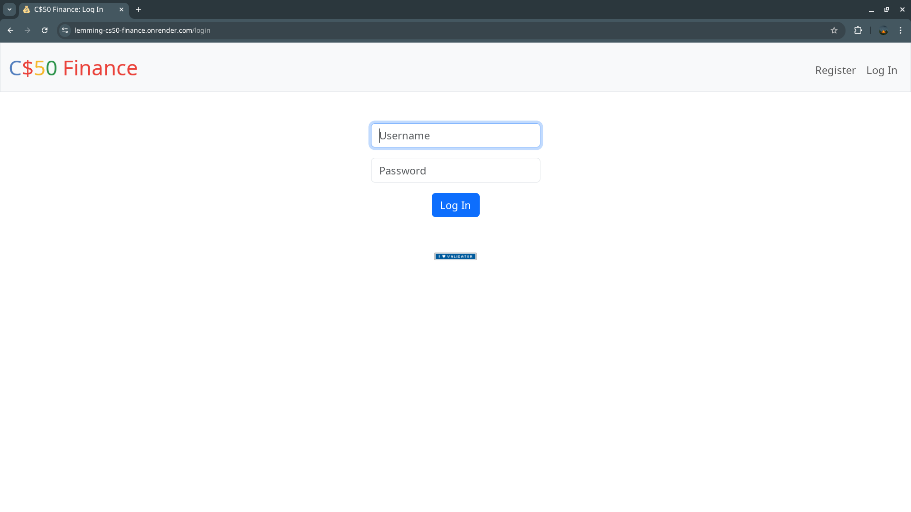
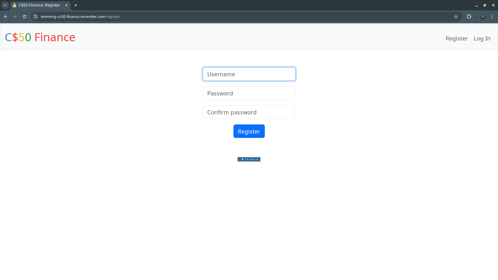
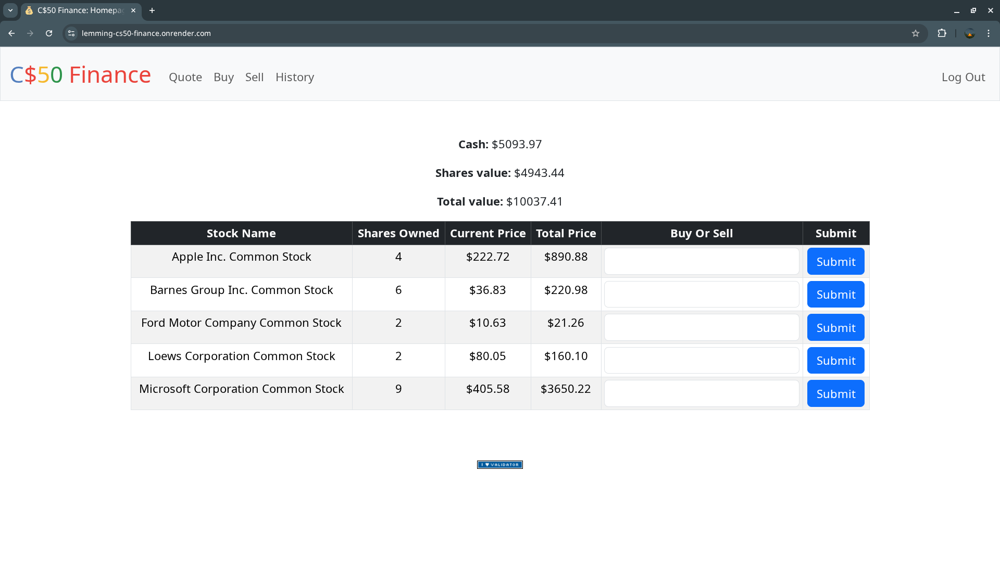
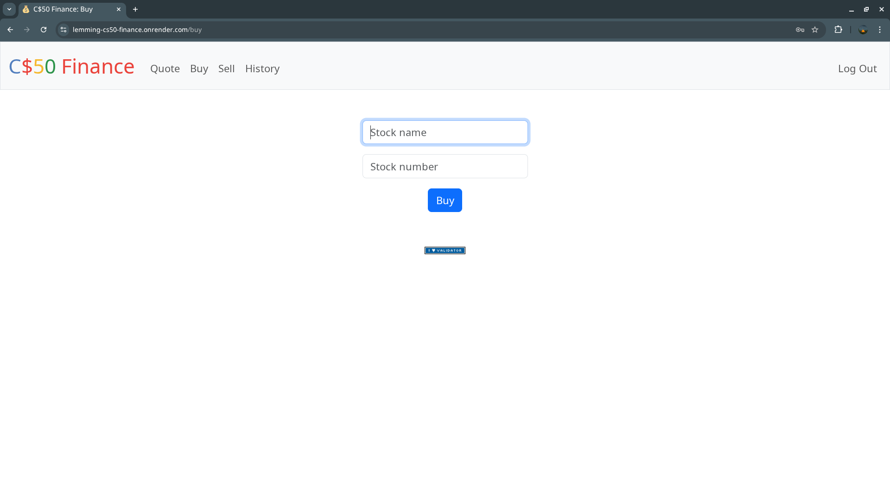
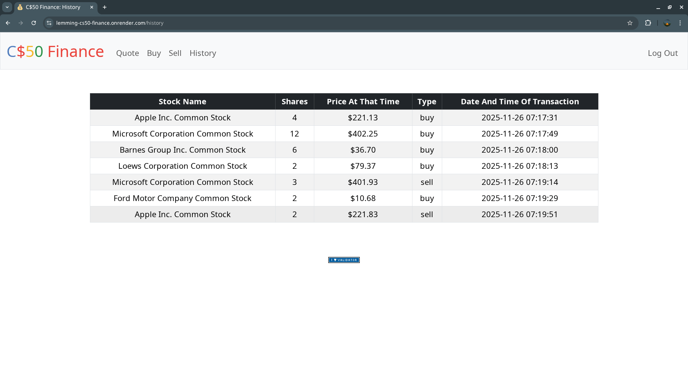
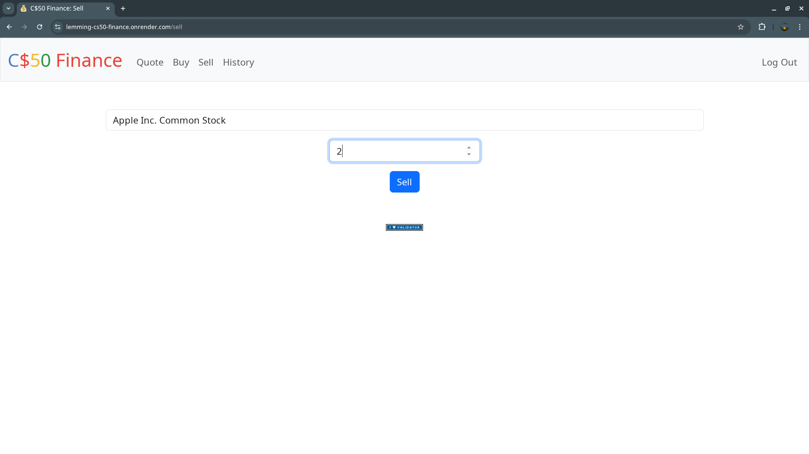
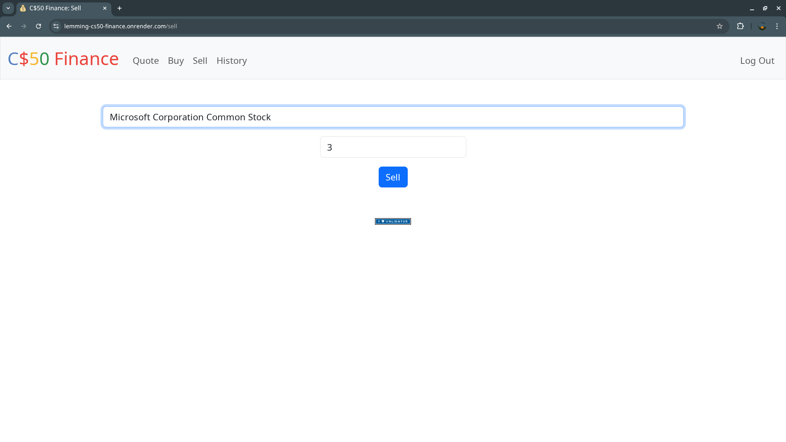

CS50 Finance
A web application that allows users to register, log in, buy/sell stocks, check stock prices using an API, and track transaction history.

Tech stack
Frontend: HTML, CSS, JavaScript
Backend: Python (Flask), SQLite
Other: Jinja templates, API usage, session management, authentication, deployment on Render

Features
- User registration/login
- Stock lookup using external API
- Portfolio value calculation
- Buy/sell operations
- Transaction history
- Real-time price fetching
- Password hashing
- Input validation
- Persistent storage via SQLite
- Deployed online via Render

➡️ <a href="https://lemming-cs50-finance.onrender.com">Live Demo</a>

Learned Flask routing, SQL queries, session management, API integration, input validation, and deploying a Python app to Render.

